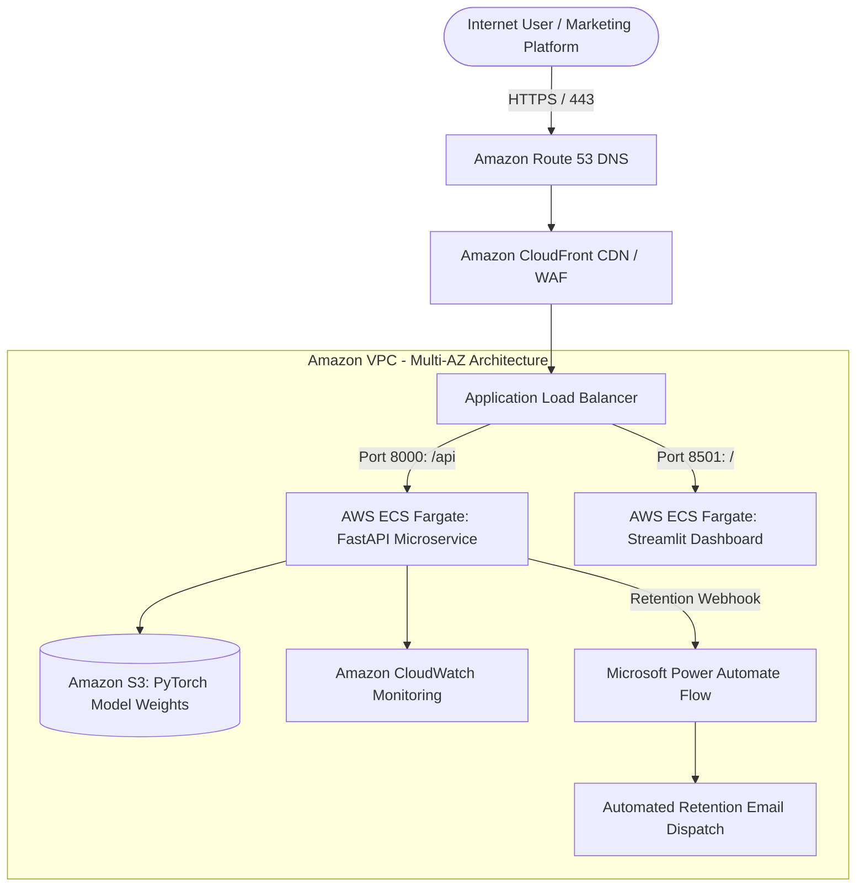
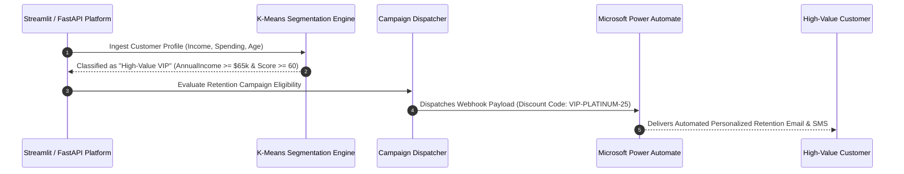

# 📊 Cloud-Deployed Customer Analytics & Predictive Platform
## PyTorch Deep Learning, Serverless Container Deployment & Automated Campaign Triggers

[](https://github.com/anuravi1604-cmd/customer-insights-dashboard)
[](Dockerfile)
[](cloud/aws_architecture.md)
[](cloud/azure_architecture.md)
[](https://pytorch.org)
[](CLOUD_CERTIFICATION_GUIDE.md)

A production-grade customer intelligence platform combining **PyTorch Deep Learning**, **FastAPI microservices**, an interactive **Streamlit dashboard**, and automated **Digital Marketing Campaign Triggers** deployed across **AWS ECS Fargate** and **Microsoft Azure**.

---

## 🚀 Key Highlights & Architectural Levers

* **Cloud-Native Deployment (AWS & Azure):** Containerized multi-service architecture ready for serverless container deployment via **AWS ECS Fargate** (backed by ALB and S3 model checkpoints) or **Azure Container Apps (ACA)**. Full specifications in [AWS Architecture](cloud/aws_architecture.md) and [Azure Architecture](cloud/azure_architecture.md).
* **Automated Retention Campaign Trigger (Digital Marketing):** Audience segmentation engine that automatically flags high-value VIP customers and at-risk cohorts, immediately dispatching personalized retention offers and dynamic discount codes via **Power Automate** and webhook integrations.
* **PyTorch Deep Learning:** 2-layer Multi-Layer Perceptron (MLP) neural network (`CustomerSpendingMLP`) utilizing PyTorch `Dataset` & `DataLoader` pipelines with $L_2$ weight decay regularization for continuous spending regression.
* **Unsupervised Customer Segmentation:** K-Means clustering assigning meaningful behavioral cohorts (*High-Value VIP*, *Growth Potential*, *Conservative Spender*).
* **Cloud Certification Alignment:** Built alongside a high-yield study and interview defense roadmap for **AWS Certified Cloud Practitioner (CLF-C02)** and **Azure Fundamentals (AZ-900)**. Full guide in [CLOUD_CERTIFICATION_GUIDE.md](CLOUD_CERTIFICATION_GUIDE.md).

---

## ☁️ Cloud Architecture Blueprint (AWS ECS Fargate)



---

## ⚡ Automated Marketing Campaign Trigger Workflow

When customer spending and demographic signals are processed, the platform automatically evaluates campaign eligibility:



---

## 🛠️ Technology Stack
* **Languages & ML:** Python 3.11, PyTorch, Scikit-learn, Pandas, NumPy
* **Backend API:** FastAPI, Uvicorn, Pydantic
* **Frontend UI:** Streamlit (Wide-screen responsive layout)
* **Cloud & DevOps:** Docker, Docker Compose, AWS ECS Fargate, Azure Container Apps, GitHub Actions CI/CD
* **Automation:** Microsoft Power Automate Webhooks, JSON Event Dispatching

---

## 🏃 Quick Start: Run Locally

### Option A: Run with Docker Compose
```bash
# Build and start all microservices
docker compose up --build

# FastAPI API: http://localhost:8000
# Streamlit Dashboard: http://localhost:8501
```

### Option B: Standard Local Setup
```bash
# 1. Clone repository
git clone https://github.com/anuravi1604-cmd/customer-insights-dashboard.git
cd customer-insights-dashboard

# 2. Install dependencies
pip install -r requirements.txt

# 3. Train PyTorch model
python3 pytorch_model.py

# 4. Start FastAPI server
uvicorn api:app --reload --port 8000

# 5. In another terminal, run Streamlit app
streamlit run app.py
```

---

## 📡 API Endpoints

| Method | Endpoint | Description |
| :--- | :--- | :--- |
| `GET` | `/health` | Service health status and container readiness |
| `GET` | `/data` | Clustered and segmented customer records |
| `POST` | `/predict/pytorch` | Deep learning inference for spending score prediction |
| `POST` | `/campaign/trigger` | Dispatches automated retention campaign via Power Automate webhook |
| `GET` | `/campaign/audiences`| Summary of active audience segments and campaign candidate counts |

---

## 📁 Repository Structure
```
customer-insights-dashboard/
├── cloud/
│   ├── aws_architecture.md     # AWS ECS Fargate & CloudFormation specs
│   └── azure_architecture.md   # Azure Container Apps & ACR specs
├── .github/
│   └── workflows/
│       └── deploy.yml          # GitHub Actions CI/CD pipeline
├── CLOUD_CERTIFICATION_GUIDE.md # AWS CLF-C02 & Azure AZ-900 interview defense
├── api.py                      # FastAPI microservice with campaign endpoints
├── app.py                      # Interactive Streamlit analytics & trigger UI
├── model.py                    # K-Means clustering & campaign logic
├── pytorch_model.py            # PyTorch MLP neural network implementation
├── customer_model.pth          # Serialized PyTorch model checkpoint
├── scaler_params.npz           # Feature standardizer weights
├── data.csv                    # Customer demographic & spending database
├── Dockerfile                  # Container build specification
├── docker-compose.yml          # Multi-service local composition
└── README.md                   # Complete architectural documentation
```

---

## 📄 License
MIT License. Developed by Anushka.
