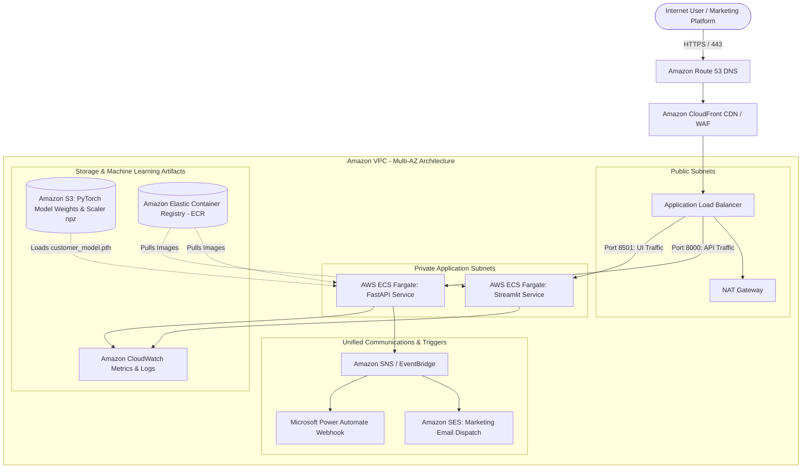

# ☁️ AWS Cloud Architecture Specification
## Customer Insights & PyTorch Predictive Analytics Platform

This document specifies the enterprise cloud infrastructure for deploying the containerized FastAPI backend and Streamlit dashboard on **Amazon Web Services (AWS)** using modern DevOps principles.

---

## 🏛️ AWS Cloud Topology



---

## 🛠️ AWS Component Specifications

### 1. Compute & Orchestration: AWS ECS Fargate (Serverless Containers)
* **Launch Type:** `Fargate` (Serverless, zero underlying EC2 management).
* **Task CPU / Memory Allocation:**
  * `FastAPI Microservice`: 0.5 vCPU, 1 GB RAM (scales on request latency > 300ms).
  * `Streamlit UI Dashboard`: 0.5 vCPU, 1 GB RAM (scales on active sessions).
* **Auto-Scaling Policy:** Target tracking scaling policy maintaining average CPU utilization $\le$ 70%.

### 2. Networking & Traffic Distribution: AWS ALB & Route 53
* **Route 53:** Global DNS routing with health-check failover and SSL certificate managed by AWS Certificate Manager (ACM).
* **Application Load Balancer (ALB):**
  * Rule 1: `/api/*` and `/predict/*` and `/campaign/*` $\rightarrow$ Forward to `FastAPI Target Group`.
  * Rule 2: Default `/` $\rightarrow$ Forward to `Streamlit Target Group`.
* **Security Groups:**
  * ALB Security Group: Inbound TCP 443/80 from `0.0.0.0/0`.
  * ECS Tasks Security Group: Inbound traffic restricted exclusively to the ALB Security Group ID.

### 3. Model Storage & Artifact Pipeline: Amazon S3
* PyTorch neural network checkpoint (`customer_model.pth`) and normalization parameters (`scaler_params.npz`) version-controlled in an encrypted S3 bucket.
* IAM Task Role with least-privilege `s3:GetObject` permission allowing the container to download updated model weights without embedding credentials.

### 4. Marketing Triggers & Unified Communications
* Outbound retention alerts evaluated by the segmentation engine dispatch events to **Amazon SNS** or direct HTTPS webhooks to **Microsoft Power Automate** and **SendGrid**.

---

## 🚀 Deployment via AWS CLI / CloudFormation

```bash
# 1. Authenticate Docker with Amazon ECR
aws ecr get-login-password --region us-east-1 | docker login --username AWS --password-stdin <aws_account_id>.dkr.ecr.us-east-1.amazonaws.com

# 2. Build and Tag Images
docker build -t customer-insights-api .
docker tag customer-insights-api:latest <aws_account_id>.dkr.ecr.us-east-1.amazonaws.com/customer-insights-api:latest

# 3. Push to ECR
docker push <aws_account_id>.dkr.ecr.us-east-1.amazonaws.com/customer-insights-api:latest

# 4. Update ECS Service
aws ecs update-service --cluster analytics-cluster --service customer-insights-svc --force-new-deployment
```
