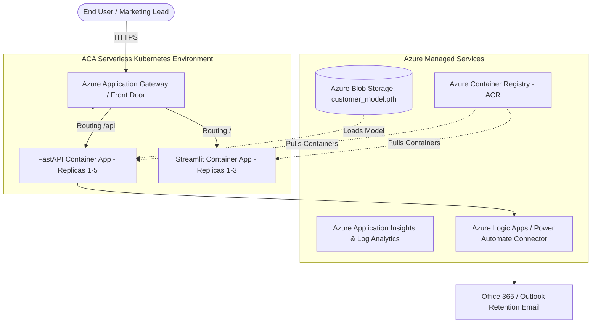

# ☁️ Microsoft Azure Cloud Architecture Specification
## Customer Insights & PyTorch Predictive Analytics Platform

This document details the alternative deployment architecture for running the containerized Customer Insights platform on **Microsoft Azure** using **Azure Container Apps (ACA)**.

---

## 🏛️ Azure Cloud Topology



---

## 🛠️ Azure Component Highlights

1. **Azure Container Apps (ACA):** Built on managed Kubernetes (K8s / KEDA), automatically scales containers down to 0 replicas during idle periods (optimizing cloud consumption) and scales up to handle marketing traffic spikes.
2. **Azure Container Registry (ACR):** Private Docker registry with automated vulnerability scanning and RBAC authorization.
3. **Azure Blob Storage & Managed Identity:** Stores PyTorch checkpoint weights; accessed seamlessly via Azure Managed Identities without static API keys.
4. **Integration with Power Automate & Logic Apps:** Native Azure connectors enabling one-click dispatch of personalized retention campaigns through unified communications channels.

---

## 🚀 Azure CLI Deployment Commands

```bash
# 1. Log in to Azure
az login

# 2. Create Azure Container Registry (ACR)
az acr create --resource-group analytics-rg --name customerinsightsacr --sku Basic

# 3. Build container directly in ACR
az acr build --registry customerinsightsacr --image customer-insights-app:v2.5 .

# 4. Deploy to Azure Container Apps
az containerapp create \
  --name customer-analytics-app \
  --resource-group analytics-rg \
  --environment analytics-env \
  --image customerinsightsacr.azurecr.io/customer-insights-app:v2.5 \
  --target-port 8000 \
  --ingress external \
  --min-replicas 1 \
  --max-replicas 5
```
